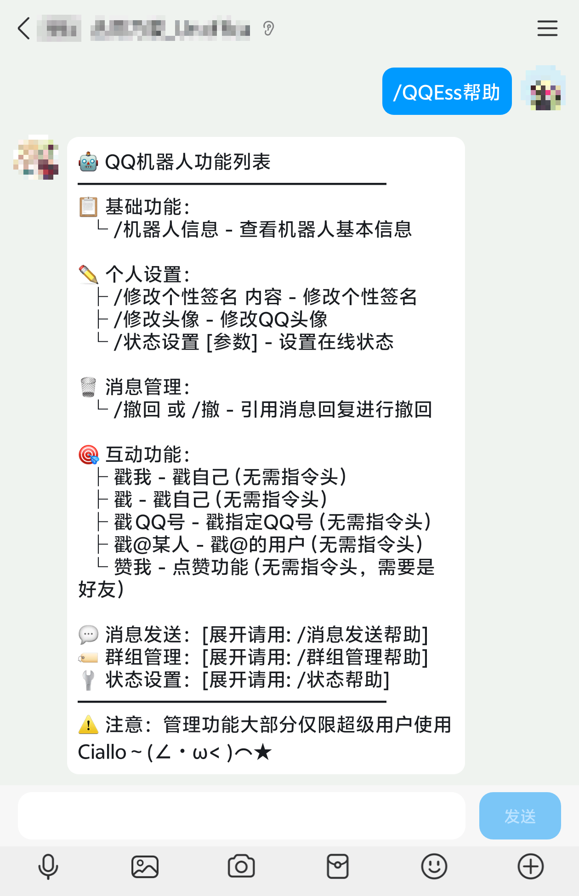

<!-- markdownlint-disable MD031 MD033 MD036 MD041 -->

<div align="center">

<a href="https://v2.nonebot.dev/store">
  
</a>

<p>
  
</p>

~~*别嘲笑我的构图了，我第一次做(T_T)*~~

# nonebot-plugin-QQEssentials

_✨ 一个能够满足你很多需求的基础插件！ ✨_

[](https://www.python.org/)
[](https://opensource.org/licenses/MIT)

</div>

## 📖 介绍

这是一个强大的QQ基础插件，覆盖了群聊管理，好友互动，Bot个人信息状态修改等功能，让你只需要使用指令就能解决很多繁琐的操作！

项目的发展少不了你们的 Issue，请对此插件提出意见或功能请求，我将尽可能实现你们的要求！

## 💿 安装

以下提到的方法 任选**其一** 即可

<details open>
<summary>[推荐] 使用 nb-cli 安装</summary>
在 nonebot2 项目的根目录下打开命令行, 输入以下指令即可安装

```bash
nb plugin install nonebot-plugin-qqessentials
```

</details>

<details>
<summary>使用包管理器安装</summary>
在 nonebot2 项目的插件目录下, 打开命令行, 根据你使用的包管理器, 输入相应的安装命令

<details>
<summary>pip</summary>

```bash
pip install nonebot-plugin-qqessentials
```

</details>
<details>
<summary>pdm</summary>

```bash
pdm add nonebot-plugin-qqessentials
```

</details>
<details>
<summary>poetry</summary>

```bash
poetry add nonebot-plugin-qqessentials
```

</details>
<details>
<summary>conda</summary>

```bash
conda install nonebot-plugin-qqessentials
```

</details>
<details>
<summary>uv</summary>

```bash
uv add nonebot-plugin-qqessentials
```

</details>

打开 nonebot2 项目根目录下的 `pyproject.toml` 文件, 在 `[tool.nonebot]` 部分的 `plugins` 项里追加写入

```toml
[tool.nonebot]
plugins = [
    # ...
    "nonebot-plugin-qqessentials"
]
```

</details>

## ⚙️ 配置

env 配置示例，变量后面为默认配置:

```.env
# 超级用户，必须设置，不然大部分指令无法使用
配置多个超级用户:["123456","234567"]
superusers=[""]

# 命令头，可选配置，默认为 "/"
command_start=["/"]

# 头像上传超时时间（秒）
avatar_upload_timeout=30

# 默认点赞次数，SVIP可考虑修改到20次
default_like_times=10

# 删除好友功能开关（默认关闭，安全考虑）
enable_delete_friend=False

# 加群请求信息推送开关（默认关闭）
enable_group_request_notify=False

# 加群请求推送目标群号列表（只有这些群的加群请求会推送到对应群）
需要 enable_group_request_notify=True
多个群号用逗号分隔，如：["123456789","987654321"]
group_request_notify_target=[]
```

## 🎉 使用

### 主要指令

带 **"/"** 则需要配置 **COMMAND_START** (默认为 "/")   
带 **"*"** 则为 **SUPERUSERS** 才可以触发   
带  **"&"** 则为 **群管理，SUPERUSERS** 才可以触发

- *`/QQEss帮助` - 主要帮助，有多个分页
- *`/状态设置` - 机器人在线状态设置，支持40+种个性状态，详情请见 `/状态帮助`
- *`/发送私聊 群消息 123456` - 详情请见 `/消息发送帮助`
- %`/同意加群请求 or /拒绝加群请求 [理由]` - 处理群聊的加群请求，需要配置 `group_request_notify_target`
- %`设精 取精` - 对消息进行精华设置/取消操作
- `戳我` - 戳戳你的❤
- `戳@Murasame` - 戳戳丛雨酱❤Ciallo～(∠・ω< )⌒★(此处指的是你在群内@的对象)

### 效果图



## 📞 联系

TG群组：[点此加入](https://t.me/LoveMurasame)
柚子厨群：[1049319982](https://qm.qq.com/q/DfTsIDXuc8)
邮箱：<congyu@sbhfy.cn>

## 💡 鸣谢

[NapCat](https://napneko.github.io/) - 高强度研究其接口实现不同功能

## 📝 更新日志

芝士刚刚发布的插件，还没有更新日志的说 qwq~


